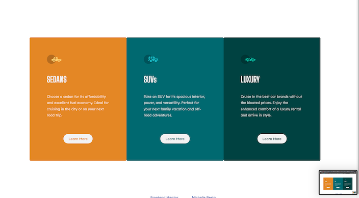
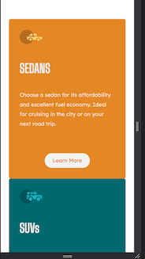

# Frontend Mentor - 3-column preview card component solution

This is a solution to the [3-column preview card component challenge on Frontend Mentor](https://www.frontendmentor.io/challenges/3column-preview-card-component-pH92eAR2-). Frontend Mentor challenges help you improve your coding skills by building realistic projects. 

## Table of contents

- [Overview](#overview)
  - [The challenge](#the-challenge)
  - [Screenshots](#screenshot)
  - [Links](#links)
  - [Built with](#built-with)
  - [What I learned](#what-i-learned)
- [Author](#author)

## Overview

The challenge is to build out this 3-column preview card component and get it looking as close to the design as possible.

### The challenge

Users should be able to:

- View the optimal layout depending on their device's screen size
- See hover states for interactive elements

### Screenshots

### Links

- Solution URL: [3 Column Preview Card](https://michelleberta.github.io/3-column-preview-card/)

### Built with

- Semantic HTML5 markup
- CSS custom properties
- Flexbox
- CSS Grid

### What I learned

I wanted to build this using Flexbox and CSS Grid because those are not as familiar to me as using Bootstrap or Materialize.  I was very pleased with the way it turned out.  I still have a lot to learn.

## Author

- Website - [Michelle Berta](https://https://michelleberta.github.io/portfolio/)
- Frontend Mentor - [@MichelleBerta](https://www.frontendmentor.io/profile/MichelleBerta)
- LinkedIn - [Michelle Berta](https://www.linkedin.com/in/michelle-berta/)
